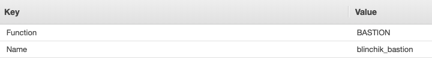

# go-aws

## Introduction

This program facilitates the useage of AWS services during the development phase. The functionality this program is providing will be growing.

## Prerequisites

aws account

go version >= 1.13

install `aws-sdk-go`

```bash
go get -u github.com/aws/aws-sdk-go/...
```

## Setup

The program reads two environment variables to get the default aws credentials and region (`GO_AWS_CRED`, `GO_AWS_REGION`).

In order to enable the program from accessing user's aws credentials, the name of desired aws account should be exported as environment variable.


**Example:**

if your `~/.aws/credentials` files has two accounts in it, and you want to choose the first one to be applied by the program;

```bash
[my-aws-account-1]
  
aws_access_key_id=xxxxxxxxxxxxxxxxxxxxxx
aws_secret_access_key=xxxxxxxxxxxxxxxxxxxxxxx

[my-aws-account-2]
  
aws_access_key_id=xxxxxxxxxxxxxxxxxxxxxx
aws_secret_access_key=xxxxxxxxxxxxxxxxxxxxxxx
```

then you have to define the credential variable `GO_AWS_CRED` as following: `export GO_AWS_CRED='my-aws-account-1'` in addation to defining the region variable `GO_AWS_REGION` (i.e. `export GO_AWS_REGION='eu-west-1'`)  

> **Note** if you are using mac and added the variables into `.bashrc` then you can add the code bellow into your `bash_profile` to have the global variables permanently defined.
>
>```bash
>if [ -f ~/.bashrc ]; then
>    . ~/.bashrc
>fi
>```

After cloning the repo, run the `setup.sh`

```bash
source ./setup.sh
```

this command will buld the go binaries and create the file in `/usr/local/bin/goaws`

then add an alias to the program

```
alias goaws='/usr/local/bin/goaws'
```

## Usage

update the hostnames in `~/.ssh/config` file with actual ip addresses

```bash
goaws refresh
```

This command will update hosts in the `~/.ssh/config` file that have matching names with the values of `Name` tag of EC2 machines 

**~/.ssh/config:**

```bash
Host blinchik_bastion
    HostName xx.xxx.x.xx
    User ubuntu
    IdentityFile /Users/xxx/.ssh/private_key.pem
```
> **Note:** identical ip addresses will be overwriten


**AWS EC2 Tags of specific machine:**



in this case, the HostName of the Host **blinchik_bastion**
blinchik_bastion

